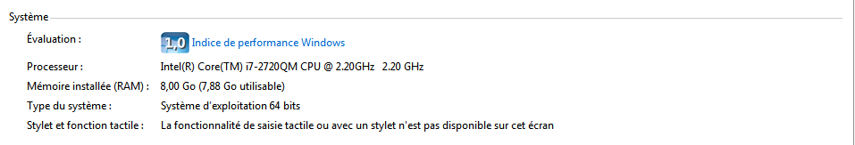

# MDP-Centrale---Assigment-1-Inverted-Index **Andrei Contantinescu**
Assignment 1 for the Massive Data Processing Class

##Preliminary information : Settings

Here we use the Cloudera virtual machine on our computer which configuration is showed below. We did not make any particular change to defaults, and chose the advised configuration when installing and setting up the Virtual Machine. We found afterwards that Hadoop worked sufficiently well with these settings.

About the computer :<br /><br />


About the Virtual Machine :<br /><br />


About Hadopp:<br /><br />


Please note that for all the following, we used the Stanford cs246 Hadoop Tutorial to set up our machine, and especially the code it provides as a skeleton for our mapreduce, only changing bits and pieces in order to fit the required tasks. So we acknowledge having taken a great deal of inspiration from their file and code.

##Preliminary information : Assumptions

Here is a snippet of our mapper class, a class to which we have only made minor changes during all of the assignment. <br /><br />
```javascript
   public static class Map extends Mapper<LongWritable, Text, Text, IntWritable> {
      private final static IntWritable ONE = new IntWritable(1);
      private Text word = new Text();

      @Override
      public void map(LongWritable key, Text value, Context context)
              throws IOException, InterruptedException {
    	  String line = value.toString();
          line = line.toLowerCase();
          StringTokenizer tokenizer = new StringTokenizer(line, " \"&#()\t\n\r\f,.:;?![]'*-[0-9]");
          while(tokenizer.hasMoreTokens()) {
         //for (String token: value.toString().split("\\s+")) {
        	  String token = tokenizer.nextToken().toLowerCase();
        	  token = token.replaceAll("[^a-z]","");
            word.set(token);
            context.write(word, ONE);
         }
      }
   }
```
Let us note two things : <br /><br />
1- the tokenization scheme : with the line of code StringTokenizer(line, " \"&#()\t\n\r\f,.:;?![]'-[0-9]") we tried to include every symbol that could mark a separation between two words.<br /><br />
2- the epuration scheme : in order to keep only words, and not weird formatting error text, we decided to add the line of code token.replaceAll("[^a-z]","") - after having set everything to lowercase- which effectively kills all non alphabetical caracters in a word. Thus we realise we loose things such as dates , but this simplification allowed us to get very effective results with little code.<br /><br />


## Question a : Implementing a stop words extractor

### Preliminary information : technique 

Making sure the output format is csv is done with the following line of code in the configuration :<br /><br />


```javascript
job.getConfiguration().set("mapreduce.output.textoutputformat.separator", ",");

```

The code for the reducer is showed below :<br /><br />
```javascript
public static class Reduce extends Reducer<Text, IntWritable, Text, IntWritable> {
      @Override
      public void reduce(Text key, Iterable<IntWritable> values, Context context)
              throws IOException, InterruptedException {
         int sum = 0;
         for (IntWritable val : values) {
            sum += val.get();
         }
         if ((sum >= 4000) && (!key.toString().isEmpty())){
         context.write(key, new IntWritable(sum));
         }
      }
```

We implement a count, and extract only words that have a count of over 4000, and we exclude the blanck spaces we created with our regular expression.<br /><br />

Below is a snippet of the result:<br /><br />


For the first question we have to use reducers. To merge the results, we can use the following line of code: <br />
```
hadoop fs -getmerge /output/dir/on/hdfs/ /desired/local/output/file.txt
```
In our case:<br />
```
hadoop fs -getmerge output result.txt
```

### Implementation details

To set the number of reducers, we can use the following line of code in the configuration:<br /><br />

```javascript
      job.setNumReduceTasks(X);

```

To use a combiner, we can use the following line of code in the configuration:<br /><br />


```javascript
      job.setCombinerClass(Reduce.class);
```

To use a compression codec we can use the following line of code:<br /><br />


```javascript
```


### Results

Below is a table resuming our results, with appropriate snippets :<br /><br />
1 reducers:<br /><br />

10 reducers:<br /><br />

50 reducers:<br /><br />

Combiner:<br /><br />

Compression:<br /><br />


Below please find a table resuming our runtim results. <br /><br />

Technique | Running Time
------------ | -------------
1 Reducer| 90 sec
10 Reducers | 203 sec
50 Reducers | 593 sec
Combiner | 73 sec
Compression | 82 sec

From this table we can conclude that for the task and the machine at hand, a very small number of reducers, even one, suffices ans yields the best results. Furthermore, compression and a combiner can improve this baseline result even though the size of the input data, circa 25 Mb is by no means big.

## Question b : Inverted index

For this question we changed the mapper, and especially the output. We kept the words as keys, but we changed the values from ONE to the name of the document. Here is the code for the mapper:<br /><br />


```javascript
   public static class Map extends Mapper<LongWritable, Text, Text, Text> {
      private String file_name = new String();
      private Text word = new Text();

      @Override
      public void map(LongWritable key, Text value, Context context)
              throws IOException, InterruptedException {
    	  file_name = ((FileSplit) context.getInputSplit()).getPath().getName();

    	  String line = value.toString();
          line = line.toLowerCase();
          StringTokenizer tokenizer = new StringTokenizer(line, " \"&#()\t\n\r\f,.:;?![]'*-");
          while(tokenizer.hasMoreTokens()) {
        	  String token = tokenizer.nextToken().toLowerCase();
        	  token = token.replaceAll("[^a-z]","");
            word.set(token);
            context.write(word, new Text(file_name));
         }
      }
   }
```

For the reducer we are using the class LinkedHashSet, which is very useful since it does not allow for duplicate values, so the name of the text will only be included once. Therefore we can implement the inverted index in this way without the duplicate problem. Below is the code for the reducer:<br /><br />

```javascript
 public static class Reduce extends Reducer<Text, Text, Text, Text> {
      @Override
      public void reduce(Text key, Iterable<Text> values, Context context)
              throws IOException, InterruptedException {
    	  int sum = 0;
    	  Set<String> s = new LinkedHashSet<String>();
    	  String doc = new String();
    	 for (Text val : values) {
    		 sum++;
            s.add(val.toString());
         }
    	  for (String val : s) {
    		  doc = doc + val + ",";
    		  
    	  }
    	  
         if ((sum <= 4000) && (!key.toString().isEmpty())){
         context.write(key, new Text(doc.substring(0, doc.length()-1)));
         }
      }
   }
```

Nothing special to remark here, just some special tecnhiques to ensure we get the right format, e.g. a comma separting the names of the files.<br /><br />

Below please find a snipped of the result:<br /><br />
Result inverted Index:<br />


##Question c : unique word count
We had to change again the mapper. This time we put the name of the document as key, and the words as values. Here is our mapper code.<br /><br />

```javascript
   public static class Map extends Mapper<LongWritable, Text, Text, Text> {
      private String file_name = new String();
      private Text word = new Text();

      @Override
      public void map(LongWritable key, Text value, Context context)
              throws IOException, InterruptedException {
    	  file_name = ((FileSplit) context.getInputSplit()).getPath().getName();

    	  String line = value.toString();
          line = line.toLowerCase();
          StringTokenizer tokenizer = new StringTokenizer(line, " \"&#()\t\n\r\f,.:;?![]'*-");
          while(tokenizer.hasMoreTokens()) {
        	  String token = tokenizer.nextToken().toLowerCase();
        	  token = token.replaceAll("[^a-z]","");
            word.set(token);
            context.write(new Text(file_name),word);
         }
      }
   }
```
Next, for the reducer we used the Hashmap class. It has the useful property of behaving like a dictionnary, which is very useful for counting purposes.  Here we adadpted the code for question d to answer this question. Here is our code for the reducer.<br /><br />

```javascript
   public static class Reduce extends Reducer<Text, Text, Text, Text> {
      @Override
      public void reduce(Text key, Iterable<Text> values, Context context)
              throws IOException, InterruptedException {
    	  HashMap<String, Integer> s = new HashMap<String, Integer>();
    	  int sum = 0;
    	 for (Text val : values) {
    		 if(s.get(val.toString())==null){
    			 s.put(val.toString(),1); 
    			 sum++;
    		 }
         }
    	  
         context.write(key, new Text(""+ sum));
      }
   }
```
The idea is to count each time a new key is added, counting as an appearance of a new word. <br />
Please find below the result of our count:<br />


## Question d

We used the same mapper as for question b.<br /><br />

For the reducer we used the Hashmap type we introduced before. Here the idea is to use this useful dictionnary that Hashmap is. The input the reducer receives is thus words as keys, and a long vector of document names, one document name for each time the word has appeared in the document. We use the Hashmap as follows : if the word has not been seen before, add it as a key in the hashmap, and set it value to 1. And then Increment by one for each time the same document name is given. The second for loop only serves to insure we have the correct output format - with the hashtag and the comma.<br /><br />

Below is the code four our reducer :<br />

```javascript
   public static class Reduce extends Reducer<Text, Text, Text, Text> {
      @Override
      public void reduce(Text key, Iterable<Text> values, Context context)
              throws IOException, InterruptedException {
    	  HashMap<String, Integer> s = new HashMap<String, Integer>();
    	  String doc = new String();
    	  int sum = 0;
    	 for (Text val : values) {
    		 sum++;
    		 if(s.get(val.toString())==null){
    			 s.put(val.toString(),1); 
    		 }
    		 else {
    			 s.put(val.toString(), s.get(val.toString())+1);
    		 }

         }
    	  for (String val : s.keySet()) {
    		  doc = doc + val + "#" + s.get(val) + ",";
    	  }
    	  
         if ((sum <= 4000) && (!key.toString().isEmpty())){
         context.write(key, new Text(doc.substring(0, doc.length()-1)));
         }
      }
}
```

Here is a snippet of our result:<br />


##Conclusion

We used Hadoop to implement a word counter, and inverted indexes. We found that for our data (i.e. the complete works of Shakespeare, Mark Twain, and Jane Austen) which does not represent a large amount of data, it was not so useful to use a large number of reducers - it actually hindered quite a lot the performance of the programme. Combiners and Compression technique ensured small performance increases. <br /><br />
For the other exercices, we implemented various count techniques, each time relying on for loops and special kind of object types which ensured we obtained the desired result.

